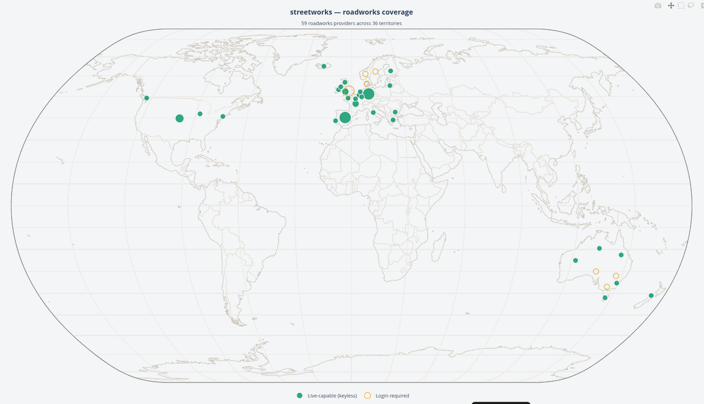
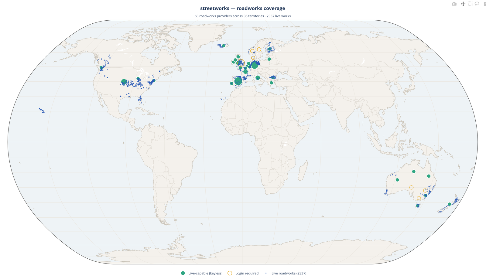
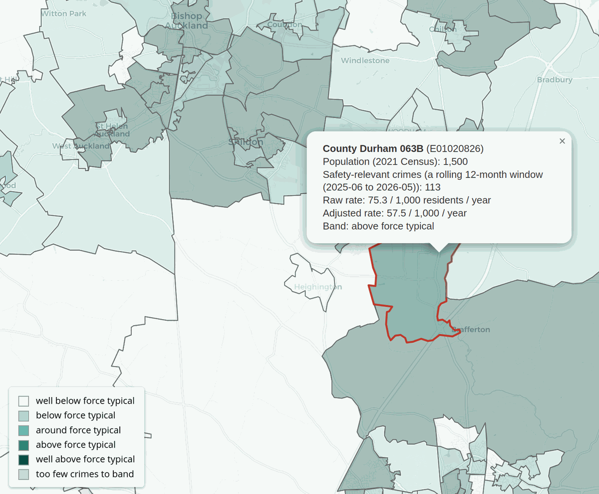
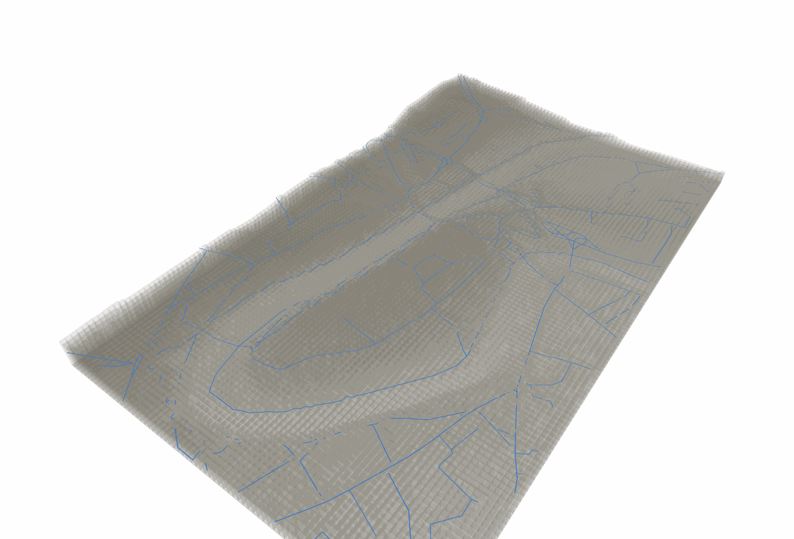

# Examples 

Run any of these from the repository root. Most need credentials for
the provider they exercise (see
[`docs/getting-started/quickstart.md`](getting-started/quickstart.md));
each one's own docstring says exactly what it needs and degrades to a
clear skip message rather than a traceback where credentials are
missing.

## Getting started

- **[`quickstart.py`](../examples/quickstart.py)** — one-file tour across every configured provider: copy `.env.example` to `.env`, fill in what you have, run it. Providers left blank are skipped; SRWR, OS Open USRN, WZDx, TrafficWatchNI, Traffic Wales and UK Police need no credentials at all. Read-only. See [`docs/getting-started/quickstart.md`](getting-started/quickstart.md).

## Street Manager

- **[`streetmanager_quickstart.py`](../examples/streetmanager_quickstart.py)** — the smallest possible Street Manager call: authenticate against the sandbox, fetch submitted permits. Read-only. See [`docs/providers/uk.md`](providers/uk.md#street-manager).
- **[`streetmanager_async_bulk.py`](../examples/streetmanager_async_bulk.py)** — pulls permits, inspections and disputed FPNs concurrently via `AsyncStreetManagerClient`, then walks every page of submitted permits. Read-only.
- **[`streetmanager_active_section58.py`](../examples/streetmanager_active_section58.py)** — reduces the Reporting API's `/section-58s` list for one USRN down to a single answer: the in-force restriction, else the next upcoming one, else nothing. Read-only.
- **[`collaboration_finder.py`](../examples/collaboration_finder.py)** — flags Street Manager works worth coordinating: same street, close in time, at least one genuinely disruptive (road closure, multi-way or two-way signals — lighter traffic management is deliberately excluded). Read-only.
- **[`streetmanager_section_50.py`](../examples/streetmanager_section_50.py)** — applies for, starts, and stops a Section 50 licence works record under a highway authority's own promoter account. **Apply/start/stop only** — reinstatement stays council-side, deliberately out of scope. Sandbox-verified end-to-end 2026-08-06 (apply/start/stop all succeeded on a real sandbox record); needs **Promoter-role** credentials specifically, not the Highway Authority login the other Street Manager examples use. Production is untouched and, per the connector's own brief, shouldn't be exercised casually given promoter-account/council-policy considerations. See [`docs/concepts/write-path.md`](concepts/write-path.md).
- **[`streetmanager_section_50_form.html`](../examples/streetmanager_section_50_form.html)** — a static mockup of the applicant-facing S50 form: no server, nothing calls Street Manager, but its "Build request" buttons run a real, faithful port of the SDK's own BNG reprojection and request-assembly logic in-page, so the JSON shown is genuinely what the Python connector above would send. Open directly in a browser. See [`docs/concepts/write-path.md`](concepts/write-path.md).
- **[`opendata_fastapi.py`](../examples/opendata_fastapi.py)** — a complete Street Manager Open Data (SNS push) receiver built on FastAPI, with signature verification. Needs a real HTTPS endpoint registered with DfT to receive anything; runs standalone otherwise. See [`docs/providers/uk.md`](providers/uk.md#street-manager-open-data-sns-push).

## Other UK registers

- **[`datavia_queries.py`](../examples/datavia_queries.py)** — three Geoplace DataVIA query shapes: a street by USRN, streets within 100m of a point, and a Special Engineering Difficulty polygon filter. Read-only. See [`docs/providers/uk.md`](providers/uk.md#geoplace-datavia).
- **[`dtro_consume.py`](../examples/dtro_consume.py)** — lists recent D-TRO events, fetches each full order, and shows the bulk CSV signed-URL route; also demonstrates local payload validation against the v3.5.1 models before publishing. Read-only (the publish path isn't exercised here). See [`docs/providers/uk.md`](providers/uk.md#dft-d-tro).
- **[`openusrn_lookup.py`](../examples/openusrn_lookup.py)** — downloads OS Open USRN (~300MB), extracts the GeoPackage, and looks up a real Durham USRN by number. No credentials required. See [`docs/providers/uk.md`](providers/uk.md#os-open-usrn).
- **[`srwr_opendata.py`](../examples/srwr_opendata.py)** — downloads the Scottish Road Works Register's daily Open Data extract and walks its activities/phases. No credentials required. See [`docs/providers/uk.md`](providers/uk.md#scottish-road-works-register-srwr-open-data).

## Europe

- **[`datex2_ndw_roadworks.py`](../examples/datex2_ndw_roadworks.py)** — downloads the Netherlands' NDW planned-works DATEX II feed and walks the roadworks, flagging urgent ones. No credentials required. See [`docs/providers/europe.md`](providers/europe.md#datex-ii-european-roadworks).

## Cross-provider

- **[`compare_active_works.py`](../examples/compare_active_works.py)** — prints active works side by side from Street Manager (Durham City) and Paris Chantiers (Paris), using one shared filter over both providers' `streetworks.common.Works`/`WorksSite` output despite their genuinely different shapes — British National Grid + an explicit status field vs. WGS84 + date-window inference. Not a fair like-for-like count (a small English city vs. a world capital); the point is the shared shape, not the comparison itself. Needs Street Manager credentials for that side; Paris is credential-free and still runs without them.
- **[`roadworks_world_map.py`](../examples/roadworks_world_map.py)** — plots SDK coverage on a world map, registry-driven so new providers appear automatically. Default mode is offline (coverage only, coloured by access tier); `--live` also pulls current roadworks from keyless providers and from credential-gated ones with a key in the environment. Marker size is provider count, not live roadworks count — a reach demonstration, not an operational feed.

  

  Real output from this example — coverage map only, not actual works sites — 09 Aug 2026. The
  generated HTML view (`roadworks_world_map/map.html`) isn't linked here: GitHub serves `.html`
  files in this repo as raw source, not a rendered page (the same reason the terrain-drape
  example's own HTML output isn't linked below). Generate it locally instead.

  

  `--live` output from the same example — 2337 real roadworks, 10 Aug 2026. A partial run, not
  full coverage: each provider is capped (`_LIMIT = 50` raw records; WZDx sweeps up to 25 of its
  ~26 keyless US/regional feeds, each still capped) so the map stays a representative sample
  rather than a full pull of registers running past a million rows. A few providers didn't appear
  in this particular run for real, one-off reasons — a rate-limited shared API key (Queensland)
  and an expired credential (Victoria) — not anything wrong with the SDK. Scotland (SRWR) is
  absent from the live points on principle, not omission: its real Open Data extract carries no
  coordinates at all, only a USRN per record, and resolving that to a real point would mean
  joining against [OS Open USRN](providers/uk.md#os-open-usrn)'s own ~300MB national geometry
  download — disproportionate just to plot a few dots, so it isn't done here. (Scotland still
  shows on the coverage layer above, correctly, as keyless-covered.)

## Worker-safety context

- **[`crime_context/`](../examples/crime_context/)** — a neighbourhood-level recorded-crime context map for one police force, built on `streetworks.police`. Background context for lone-worker/night-shift planning around street works — explicitly not a risk score or risk assessment. See its own [README](../examples/crime_context/README.md).
- **[`crime_context_lsoa/`](../examples/crime_context_lsoa/)** — successor to `crime_context/`: LSOA-level geography, a real population denominator, and reframed around a single worksite ("what's the context for the crew going here") rather than a force-wide ranking. See its own [README](../examples/crime_context_lsoa/README.md).

  

  Real output from this example — the tooltip's population, crime-rate and banding figures are genuine, not illustrative.

## Terrain visualisation

- **[`nsg_terrain_drape/`](../examples/nsg_terrain_drape/)** — drapes OS Open USRN street centrelines over real terrain (OS Terrain 50) for Durham, as a rendered showcase with a genuine teaching point riding along: the drape is derived from two independently-sourced datasets, not stated by either, and it breaks in predictable, visible ways where they disagree. Produces a self-contained HTML view and an STL export for 3D printing. First run downloads and caches OS Open USRN (~300MB) and OS Terrain 50 (~160MB). See its own [README](../examples/nsg_terrain_drape/README.md).

  

  Real output from an early build — kept because it documents a real rendering artifact (a road briefly dipping under a neighbouring terrain block where two independent samplings of the same terrain disagreed), since fixed; see `render.py`'s own docstring.

  The generated HTML view itself (`durham_3D_showcase.html`) isn't linked here: GitHub serves `.html` files in this repo as raw source, not a rendered page, and this repo has no GitHub Pages site to render it live. Generate and open it locally instead (see the README linked above).
